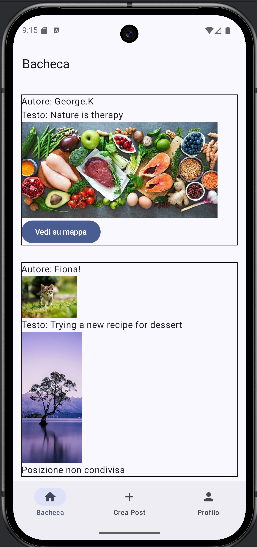
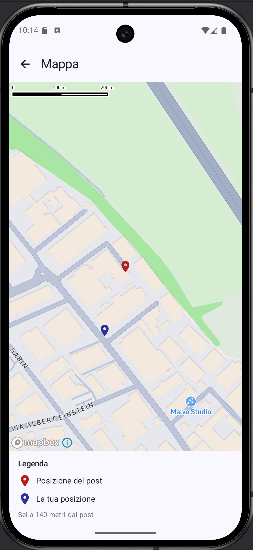
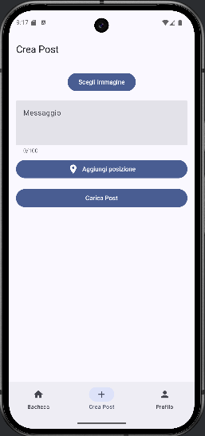
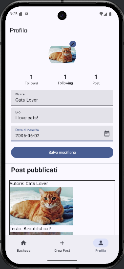
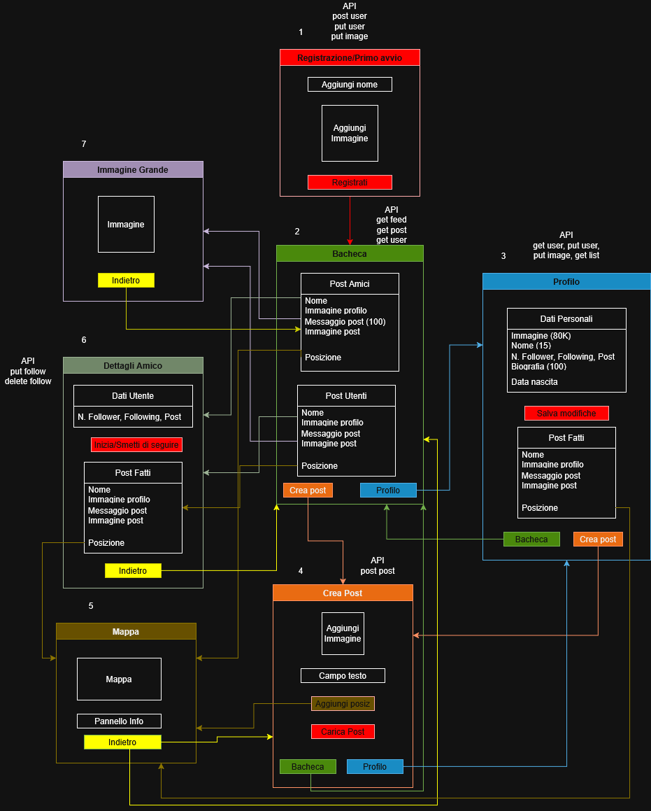

# Fotogram
Progetto realizzato per il corso di Mobile Computing (a.a. 2025/26).

Prototipo di client Android per un social network basato sulla condivisione
di immagini. Sviluppato in Kotlin e Jetpack Compose, con Mapbox per la
gestione delle mappe. Sviluppato con Android Studio.

 
 

## Feature principali
- Registrazione e login
- Bacheca con feed dei post degli utenti seguiti e non
- Creazione post (con immagine, testo e posizione opzionale)
- Dettagli amico (profilo, follow/unfollow, post pubblicati)
- Visualizzazione posizione dei post su mappa
- Gestione profilo utente

## Schema di navigazione

## Documentazione
- [Specifica del progetto](docs/SpecificaProgetto.pdf)
- [Documentazione completa](docs/Documentazione.pdf)

## Setup
- Android Studio
- minSdk 36 / targetSdk 36
- Richiede una API key Mapbox da inserire in res/values/mapbox_access_token.xml
